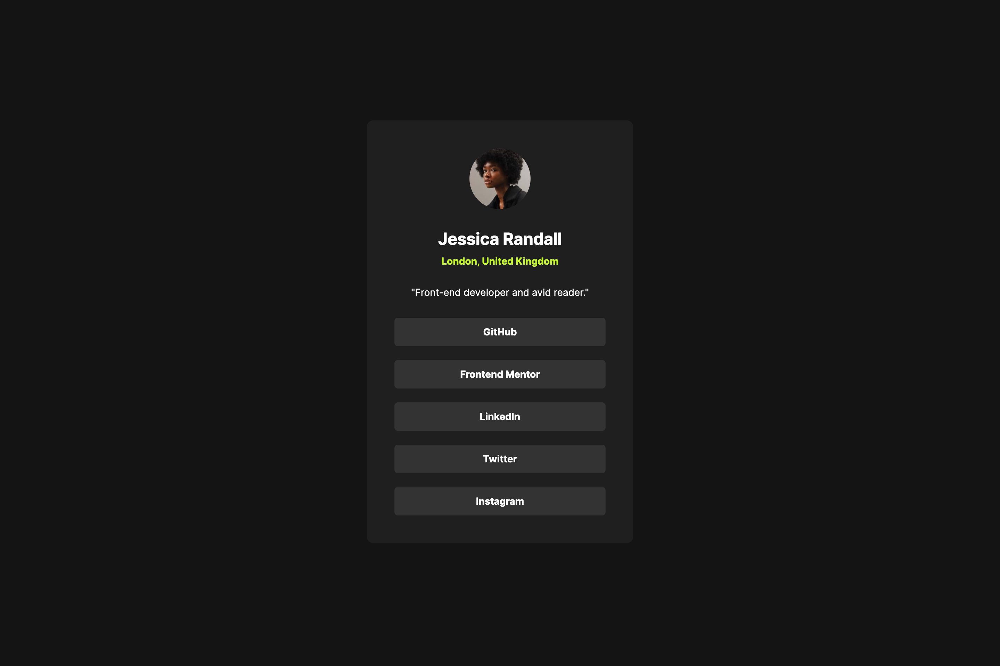

# Frontend Mentor - Social links profile solution

This is a solution to the [Social links profile challenge on Frontend Mentor](https://www.frontendmentor.io/challenges/social-links-profile-UG32l9m6dQ). Frontend Mentor challenges help you improve your coding skills by building realistic projects.

## Table of contents

- [Overview](#overview)
  - [The challenge](#the-challenge)
  - [Screenshot](#screenshot)
  - [Links](#links)
- [My process](#my-process)
  - [Built with](#built-with)
  - [What I learned](#what-i-learned)
  - [Continued development](#continued-development)
  - [Useful resources](#useful-resources)
- [Author](#author)

## Overview

### The challenge

Users should be able to:

- See hover and focus states for all interactive elements on the page

### Screenshot

|  Mobile designed at 375px:   |  Desktop designed at 1440px:  |
| :--------------------------: | :---------------------------: |
|  |  |

### Links

- Solution URL: [https://github.com/elisilk/social-links-profile](https://github.com/elisilk/social-links-profile)
- Live Site URL: [https://elisilk.github.io/social-links-profile/](https://elisilk.github.io/social-links-profile/)

## My process

### Built with

- Semantic HTML5 markup
- CSS custom properties
- Flexbox
- Mobile-first workflow

### What I learned

- [Flex](https://developer.mozilla.org/en-US/docs/Web/CSS/flex) - I still have to get more comfortable with Flex, especially knowing [what is the main axis and what is the cross axis](https://developer.mozilla.org/en-US/docs/Web/CSS/flex), and then how that changes to use of and behavior of the [align-\* vs. justify-\* properties](https://developer.mozilla.org/en-US/docs/Web/CSS/CSS_flexible_box_layout/Aligning_items_in_a_flex_container). I really wanted to create a profile box that filled the available space but had a max width after which point it would no longer grow.

### Continued development

- [Principles of writing consistent, idiomatic CSS](https://github.com/necolas/idiomatic-css) - I want to be more consistent and organized in how I order my CSS files and provide comments.

### Useful resources

- [MDN Web Docs](https://developer.mozilla.org/en-US/docs/Web) - Of course, as always. So useful.

## Author

- Website - [Eli Silk](https://github.com/elisilk)
- Frontend Mentor - [@elisilk](https://www.frontendmentor.io/profile/elisilk)
